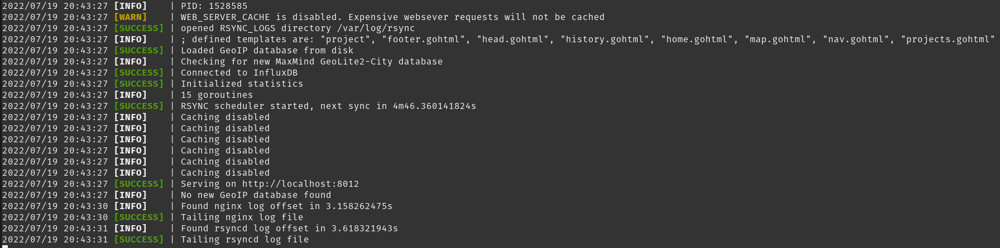

# logging

This module provides thread-safe logging and Discord notifications as a part of our [Mirror](https://github.com/COSI-Lab/Mirror) project.



There are plenty of low-priority improvements that can be made to this module.

## Example

```go
package main

import (
    "github.com/COSI-Lab/logging"
)

func main() {
    // Optional: If you only want messages to be displayed in the terminal there is no need to run `Setup`
    // logging.Setup("https://discord.com/api/webhooks/987654321123456789/S3cR3TwebH00KuRl", "01234567890123456789")

    ch := make(chan struct{})

    go func() {
        // The last argument to all the logging functions is a variadic ...interface{} which is eventually evulated with fmt.Println(...v)
        logging.InfoWithAttachment(bytes("Attachment"), "Hello", "World!")
        ch <- struct{}{}
    }()

    go func() {
        logging.ErrorToDiscord("This subsystem failed!")
        ch <- struct{}{}
    }()

    <-ch
    <-ch
}
```
