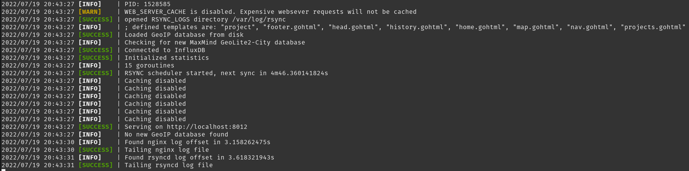

# logging

This module provides thread-safe logging2.



## Usage

```go
package main

import (
    "github.com/COSI-Lab/Mirror/logging"
)

func main() {
    logging2.Info("Hello, world!")
    logging2.Warn("Warning world didn't say hello back!")
    logging2.Error("Error world is broken!")
}
```
